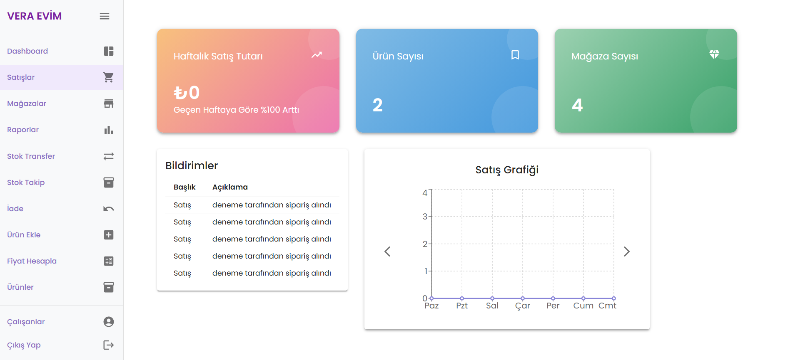
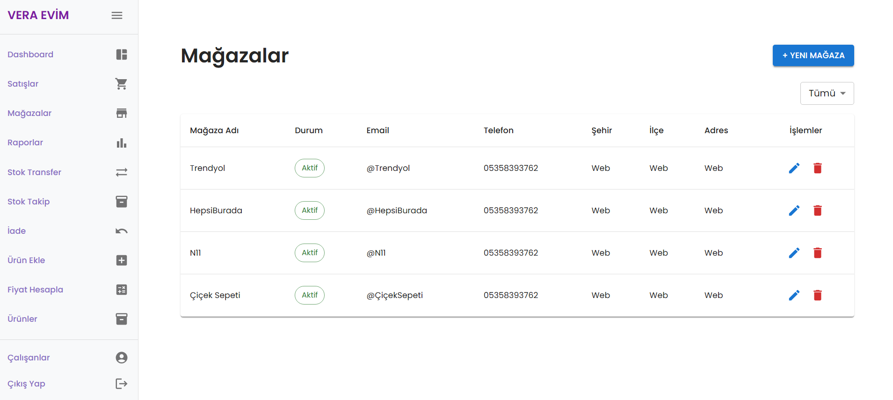
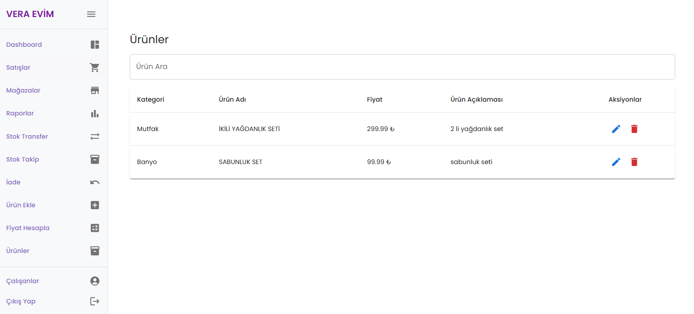
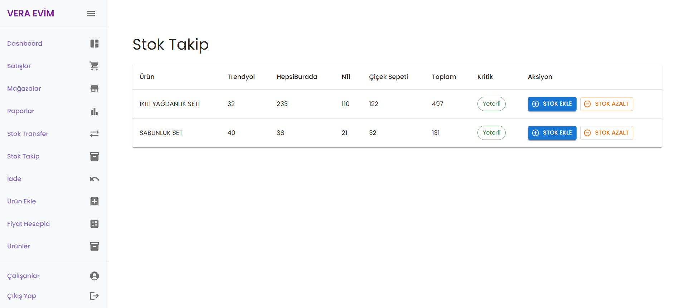
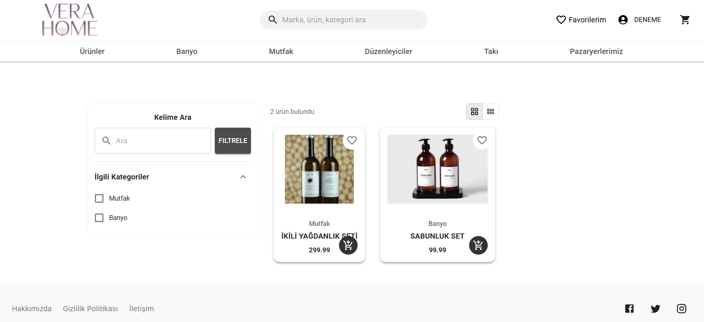
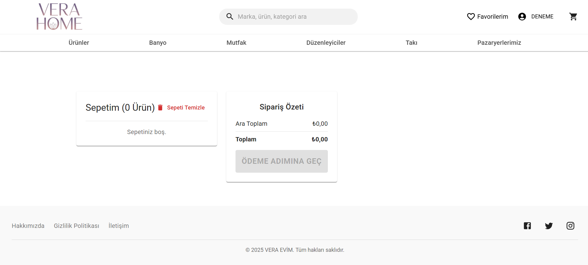
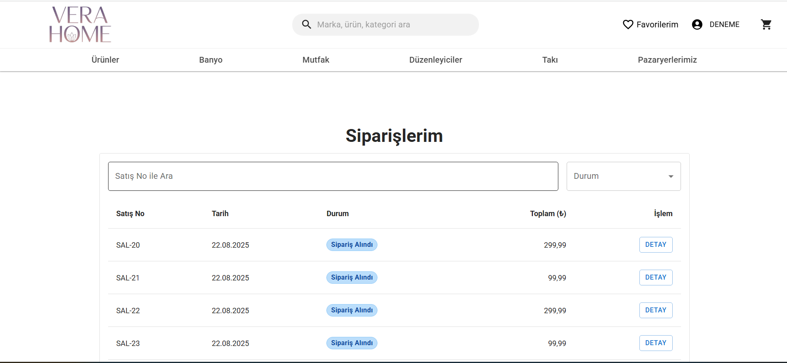

# 🛒 Vera Evim & Vera Home - E-Ticaret ve Yönetim Sistemi

Bu proje, modern bir e-ticaret deneyimi sunmak ve arka planda çok kanallı (omnichannel) bir mağaza yönetim sistemi sağlamak amacıyla geliştirilmiş Full-Stack bir web uygulamasıdır.

Proje; müşteriler için kullanıcı dostu bir alışveriş arayüzü, yöneticiler için ise detaylı stok, sipariş ve pazar yeri entegrasyonu sağlayan kapsamlı bir admin paneli içerir.

## 🚀 Proje Hakkında
Bu sistem gerçek hayat senaryoları düşünülerek tasarlanmıştır. Sadece ürün satışı değil, aynı zamanda Trendyol, Hepsiburada, N11 gibi pazar yerleri ile entegre çalışabilen bir altyapıya sahiptir.

### 🛠️ Kullanılan Teknolojiler
* **Frontend:** React
* **Backend:** .NET Core (Katmanlı Mimari / N-Tier Architecture)
* **Veritabanı:** SQLite

---

## 🖥️ Yönetici Paneli (Admin Dashboard)

Yöneticilerin tüm e-ticaret süreçlerini tek bir merkezden yönetmesini sağlayan paneldir.

### 1. Genel Bakış (Dashboard)
Yöneticinin sisteme girdiğinde karşılaştığı özet ekran. Günlük/haftalık satış grafikleri, toplam ürün ve mağaza sayıları ile son gelen bildirimler burada listelenir.


### 2. Çoklu Mağaza Yönetimi
Sistem, birden fazla pazar yerini (Trendyol, Hepsiburada, N11, Çiçek Sepeti) destekler. Mağazaların aktiflik durumları ve iletişim bilgileri buradan yönetilir.


### 3. Ürün Yönetimi
Platformdaki ürünlerin listelendiği, fiyat ve kategori bilgilerinin düzenlendiği ekrandır.


### 4. Gelişmiş Stok Takibi
Belki de projenin en kritik özelliği: Bir ürünün hangi pazar yerinde kaç adet stoğu kaldığını tek ekranda gösterir. "Stok Ekle/Azalt" butonları ile hızlı müdahale imkanı sağlar.


---

## 🛍️ Kullanıcı Arayüzü (Web Sitesi)

Müşterilerin ürünleri inceleyip sipariş verebildiği modern ön yüz.

### 1. Ürün Arama ve Listeleme
Kullanıcılar kategorilere göre filtreleme yapabilir veya arama çubuğu ile istedikleri ürüne hızlıca ulaşabilirler.


### 2. Sepet Yönetimi
Kullanıcı dostu, sade ve anlaşılır sepet ekranı.


### 3. Sipariş Geçmişi
Kullanıcılar "Siparişlerim" sayfasından geçmiş siparişlerinin durumunu (Sipariş Alındı, Kargolandı vb.) ve detaylarını takip edebilirler.


---

## 📦 Kurulum

Projeyi yerel makinenizde çalıştırmak için:

1. Repoyu klonlayın:
   ```bash
   git clone [https://github.com/kesiciiumut/EticaretUdemy.git](https://github.com/kesiciiumut/EticaretUdemy.git)
